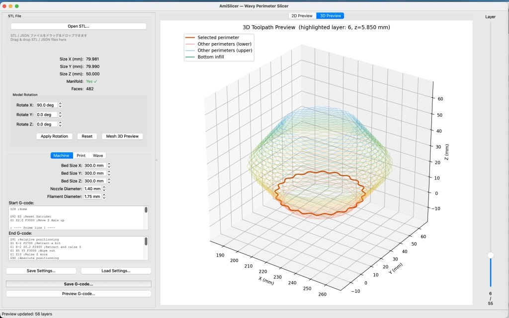
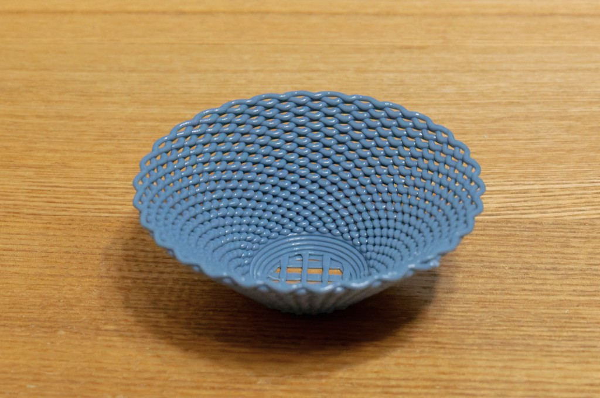

# ⚠️現在の公開状況 / Current Availability

⚠️AmiSlicer は αテスト版として試験公開していましたが、いただいたフィードバックを踏まえ、公開方法・説明・位置づけを見直すため、現在はアプリ本体を非公開としています。
本リポジトリでは、開発時に作成したマニュアルと技術的な記録のみ公開しています。実行ファイルや配布用データは含まれていません。

⚠️AmiSlicer was previously released as an alpha test version, but is currently private while its presentation, documentation, and positioning are being reconsidered in response to feedback.
This repository contains only the manual and technical records created during development. Executable files and distributable application data are not included.

---

# AmiSlicer

> ⚠️ **Alpha Release (v0.01)** — This software is in early development.  
> ⚠️ **アルファ版 (v0.01)** — 本ソフトウェアは開発段階のアルファ版です。

---

## 概要 / Overview

AmiSlicerは、STLモデルの外周にサイン波変形を加えたG-codeを生成する実験的スライサーです。  
層ごとに位相を反転させることで、編み込まれたような構造を生成します。

AmiSlicer is a **generative slicer** that converts STL models into G-code with sinusoidal perimeter deformation.  
It creates unique woven-like surface structures by alternating phase between layers.

---

## 原理 / Principle

一般的に、3Dプリンタでは STL データ（3D CAD などで用いられる、物体表面を三角形メッシュで表現したデータ）を、スライサーソフトによって G-code（3Dプリンタを動かすための命令コード）へ変換し、その G-code を用いて印刷を行います。通常は、変換元の STL データの形状をできるだけ忠実に再現することが目指されます。

一方、本アプリでは形状の忠実な再現だけを目的とせず、外周のツールパスに互い違いとなる波形を与えることで、編み込まれたように見える構造を生成します。

本ソフトは、そのような造形手法の原理検証を目的とした実験的なアプリケーションです。

In general, 3D printing uses STL data—one of the most common file formats in 3D CAD and 3D printing, representing an object's surface as a collection of triangular meshes—which is converted into G-code, the command language used to control a 3D printer, by slicing software. The printer then fabricates the object based on that G-code. In most cases, the goal is to reproduce the original STL geometry as faithfully as possible.

In contrast, this application does not focus solely on faithful reproduction of the source geometry. Instead, it generates alternating wave patterns along the outer toolpath to create a structure that appears woven.

This software is an experimental application created to explore and verify the underlying principle of such a fabrication method.

---

## 参考にした文脈・先行事例

本プロジェクトは、FDM 3Dプリントにおける積層表現、工芸的な造形、ならびにツールパス / G-Code の直接設計に関する先行事例を参考にしています。

特に以下の文脈に影響を受けています。

- **新工芸舎 / 三田地博史 – 「編み重ね」および tilde**
    
    FDM の積層痕を隠すべき欠点ではなく、プロダクトの表情と合理性の一部として扱う実践。2019年に発表された tilde シリーズでは、編み重ねる表現が用いられています。新工芸舎は、編み込まれたような構造や大きな積層ピッチを活かしたプロダクトを継続的に発表してきた、本分野における重要な先行事例のひとつです。
    
    私自身も展示を拝見し、プロダクトに触れてきました。本プロジェクトでもこの事例を参考にしています。
    
    リンク：https://www.shinkogeisha.com/
    
- **金田泰 – draw3dp / 手続き的3D印刷**
    
    Python を用いて 3Dプリントを手続き的に記述し、印刷指示を直接生成する日本の先行研究・実践。
    
    私自身も、2017年に FabCafe で開催された金田泰さんによるワークショップ『「3D Printing」×「Python」×「Light」オリジナルiPhoneランプを作ろう』に参加し、Python による G-code 生成について学びました。
    
    リンク：https://www.kanadas.com/3dprint/IPSJ-MGN580606.pdf
    
    リンク：https://fabcafe.com/jp/events/tokyo/3d-printing_python_light/
    
- **G-coordinator / タム / Taniguchi Tomohiro**
    
    Python ベースで 3Dプリンタのパス（G-code）を直接設計・生成するための Python ライブラリ gcoordinator と、その利用を支援する GUI アプリケーション G-coordinator。
    
    私自身も G-coordinator を用いて、編み上げる構造を含むさまざまな形状を設計し、3Dプリンタで出力してきました。その経験から、STL データから直接 G-code を生成する本アプリの構想に至りました。
    
    リンク：https://gcoordinator.readthedocs.io/ja/latest/index.html
    
    リンク：https://qiita.com/tomohiron907/items/a0cd01273650a882ed63
    
- **FullControl GCODE Designer**
    
    G-code を直接設計・生成するためのオープンソースツール。一般的なスライサーとは異なり、CAD モデルや STL ファイルを前提とせず、数理的なパラメータに基づいて印刷経路を設計できる点に特徴があります。独自の積層パターンや非平面印刷の検討において参考になる事例です。
    
    リンク：https://fullcontrolgcode.com/
    
- **Triple Bottom Line / ひとしんし**
    
    3Dプリンタでレイヤーを形成する際に、x 軸・y 軸に加えて z 軸方向にもノズルを動かし、編み目のような造形やコンピュテーショナルな造形を用いたプロダクトを発表しています。また、その知見を note などを通じて広く発信しています。
    
    私自身もプロダクトと記事を拝見し、3Dプリンタのパラメータ設定の参考にしています。
    
    リンク：http://triplebottomline.cc/
    
    リンク：https://note.com/triplebottomline/n/n0e5d7a0cdb78

## Context and Prior References

This project was developed with reference to prior work related to layered expression in FDM 3D printing, craft-oriented fabrication, and the direct design of toolpaths and G-code.

In particular, the following contexts have been influential:

- **Shinkogeisha / Hiroshi Mitachi – “Ami-kasane” and tilde**
    
    A practice that treats FDM layer lines not as defects to be hidden, but as part of the product’s expression and rationality. In the *tilde* series, first presented in 2019, an “ami-kasane” layered expression is used. Shinkogeisha has continuously presented products that make use of woven-looking structures and large layer pitches, and is one of the most important prior references in this field.
    
    I have also visited their exhibitions and experienced their products in person. This project was developed with reference to their work.
    
    Link: https://www.shinkogeisha.com/
    
- **Yasushi Kanada – draw3dp / procedural 3D printing**
    
    An important Japanese precedent in which 3D printing is described procedurally using Python and print instructions are generated directly.
    
    I also attended Yasushi Kanada’s 2017 workshop at FabCafe, “3D Printing × Python × Light: Create Your Own Original iPhone Lamp,” where I learned about generating G-code with Python.
    
    Link: https://www.kanadas.com/3dprint/IPSJ-MGN580606.pdf
    
    Link: https://fabcafe.com/jp/events/tokyo/3d-printing_python_light/
    
- **G-coordinator / Tomohiro Taniguchi**
    
    *gcoordinator* is a Python library for directly designing and generating 3D printer paths (G-code), and *G-coordinator* is a GUI application that supports its use.
    
    I have also used G-coordinator to design and print various forms, including woven-like structures. Through that experience, I arrived at the idea of this application, which generates G-code directly from STL data.
    
    Link: https://gcoordinator.readthedocs.io/ja/latest/index.html
    
    Link: https://qiita.com/tomohiron907/items/a0cd01273650a882ed63
    
- **FullControl GCODE Designer**
    
    An open-source tool for directly designing and generating G-code. Unlike conventional slicers, it does not assume a CAD model or STL file as its starting point, and instead enables print paths to be designed from mathematical parameters. It is a useful reference for exploring original layer patterns and non-planar printing.
    
    Link: https://fullcontrolgcode.com/
    
- **Triple Bottom Line / Hitoshinshi**
    
    A practice that moves the nozzle in the Z direction in addition to the X and Y axes while forming layers, producing products with woven-like and computational forms. Their knowledge is also widely shared through note and other media.
    
    I have also seen their products and articles, and have referred to them when considering parameter settings for 3D printing.
    
    Link: http://triplebottomline.cc/
    
    Link: https://note.com/triplebottomline/n/n0e5d7a0cdb78

---
## 主な機能 / Features

- STLスライス / STL slicing 
- 外周へのサイン波変形 / Sinusoidal perimeter modulation
- レイヤー間の位相反転（アミアミ構造） / Alternating phase between layers  
- Z方向の波変形 / Optional Z-direction modulation
- 自己交差検出・修正 / Self-intersection detection and correction
- 2D・3Dプレビュー / 2D / 3D preview
- G-code出力 / G-code export
- 設定の保存・読み込み/ JSON-based settings

---

## 基本の流れ / Getting Started

1. STLを読み込む  
2. モデルの向きを調整する  
3. 3Dプリンタ設定と印刷設定を入力する  
4. 波のパラメータを設定する  
5. 2D / 3Dプレビューで確認する  
6. 必要に応じて自己交差を修正する  
7. G-codeを保存する  
8. 3Dプリンタで造形する
9. 
---

1. Open an STL file  
2. Adjust the model orientation  
3. Configure machine and print settings  
4. Configure wave parameters  
5. Check the result in 2D / 3D preview  
6. Fix self-intersections if necessary  
7. Export G-code  
8. Print on your 3D printer  

---

## 詳細マニュアル / Documentation
- 日本語マニュアル: [docs/manual_ja.md](docs/manual_ja.md)
- English Manual: [docs/manual_en.md](docs/manual_en.md)

---

## ⚠️ 注意事項 / Notes

- 枝分かれするような形状（断面が複数になる形状）には対応していません。
- 内側にも構造がある形状（ドーナツのような形状）には対応していません。
- 編み込まれた形状を作るには、製作したい造形物の形状、ノズル径、フィラメント材料、3Dプリンタが設置されている環境に合わせて、ノズル温度、ワーク速度、押し出し量などのパラメータを細かく調整する必要があります。

- Shapes with branching cross-sections are not supported.
- Shapes with internal structures that produce multiple contours in a slice, such as donut-like geometry, are not supported.
- To create stable woven structures, parameters such as nozzle temperature, print speed, and extrusion amount must be carefully adjusted according to the target geometry, nozzle diameter, filament material, and the environment where the 3D printer is installed.

---

## ⚠️ 安全に関する注意 / Safety Notice
- 本ソフトウェアは実験的なソフトウェアであり、予期しない動作やバグを含む可能性があります。
- 本ソフトウェアは3Dプリンタのヒーターやモーターを制御するG-codeを生成します。十分注意して使用してください。
- 印刷中は3Dプリンタから離れないでください。
- 初めて使用する際は、温度や動作が正しいことを確認するため、必ずテスト印刷を行ってください。
- 印刷後は、ノズルやヒートベッドが十分に冷えており、安全に印刷が完了していることを確認してください。
- 本ソフトウェアの使用によって生じた損害や損失について、作者は責任を負いません。

- This software is experimental and may contain unexpected behavior or bugs.
- This software generates G-code that controls 3D printer heaters and motors. Please use it with caution.
- Do not leave your 3D printer unattended while printing.
- When using this software for the first time, perform a test print to confirm that temperature and motion are correct.
- After printing, make sure that the nozzle and heat bed have cooled down properly and that the print has finished safely.
- The author is not responsible for any damage or loss caused by the use of this software.

---

## 📄 ライセンス / License

MIT License

---

<strong>AmiSlicer v0.01 Alpha</strong> 
Author / 製作者: Yosuke Hori / kasanetarium

