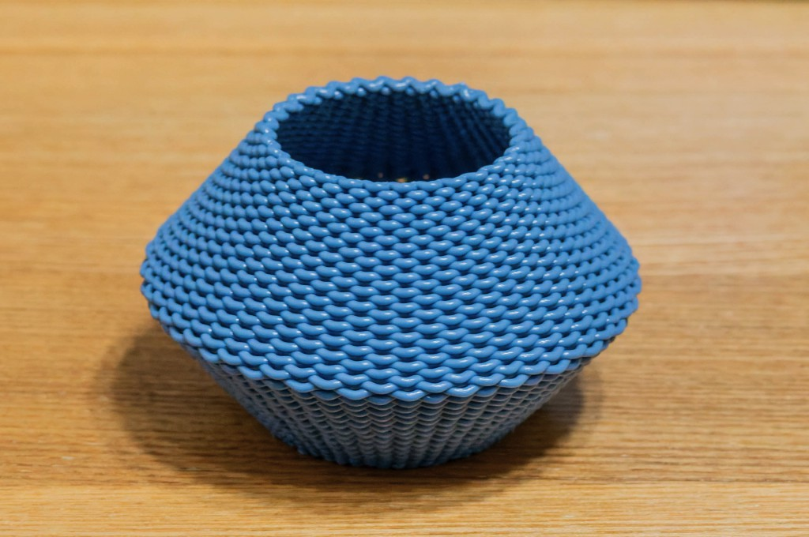
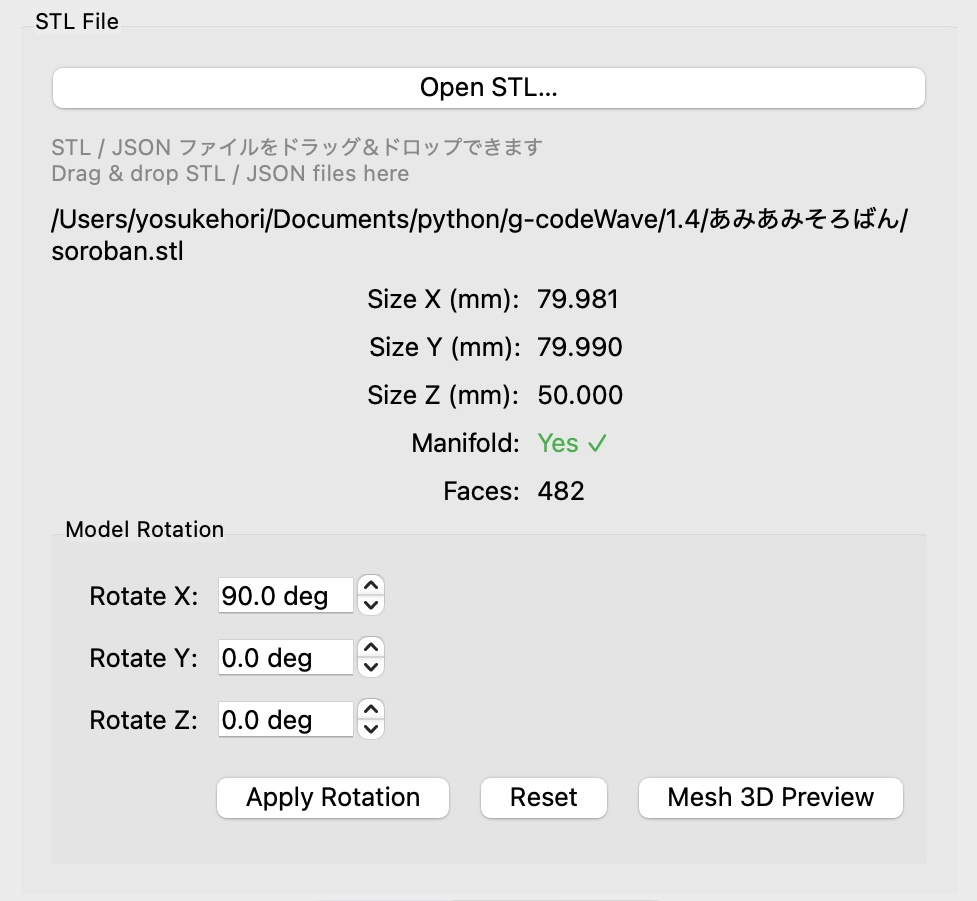
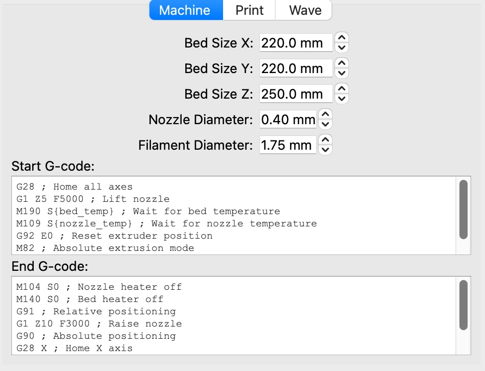
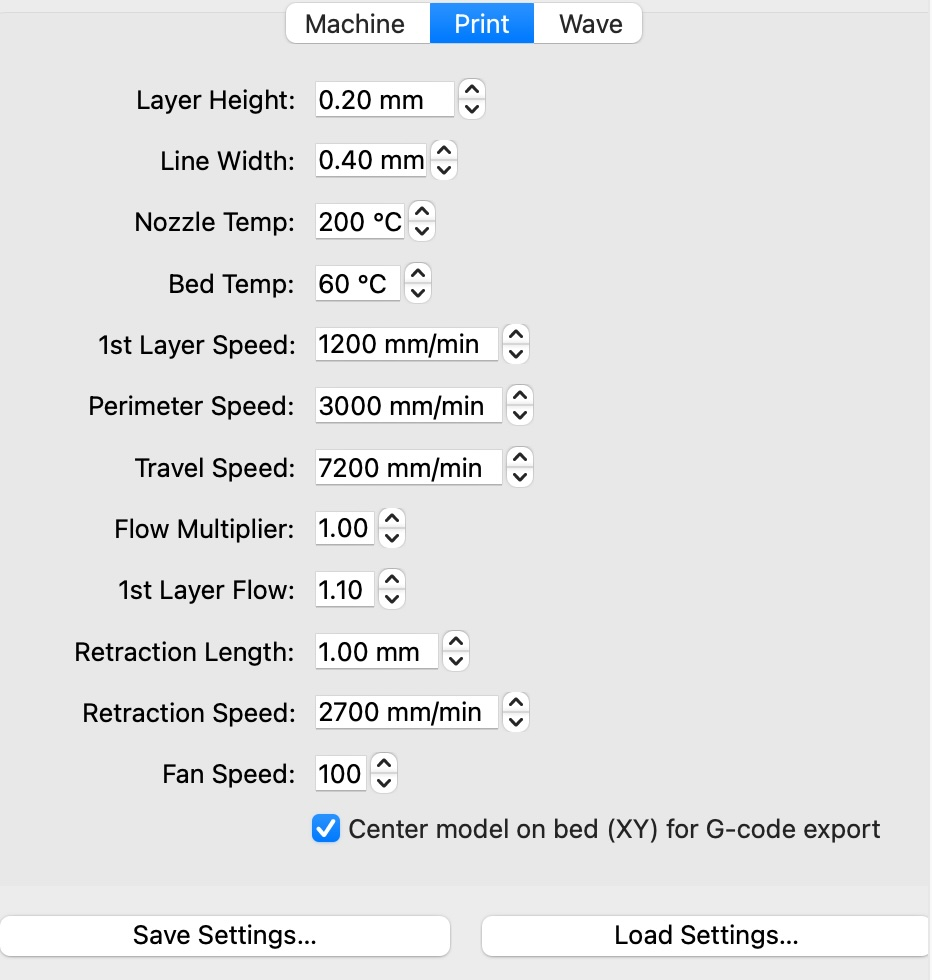
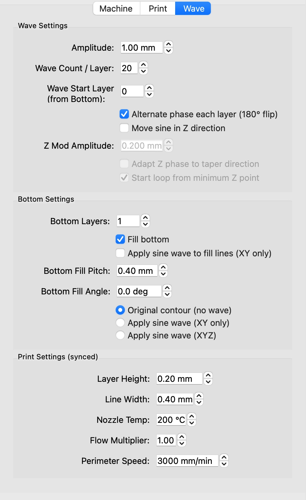
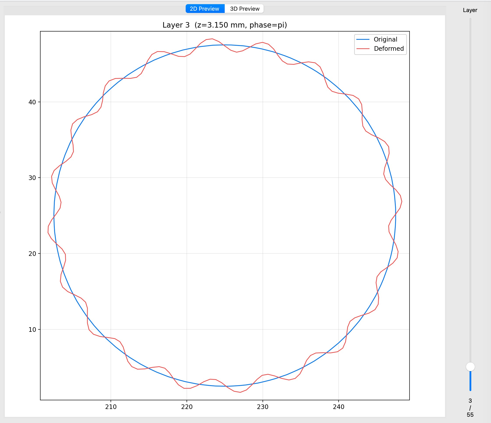
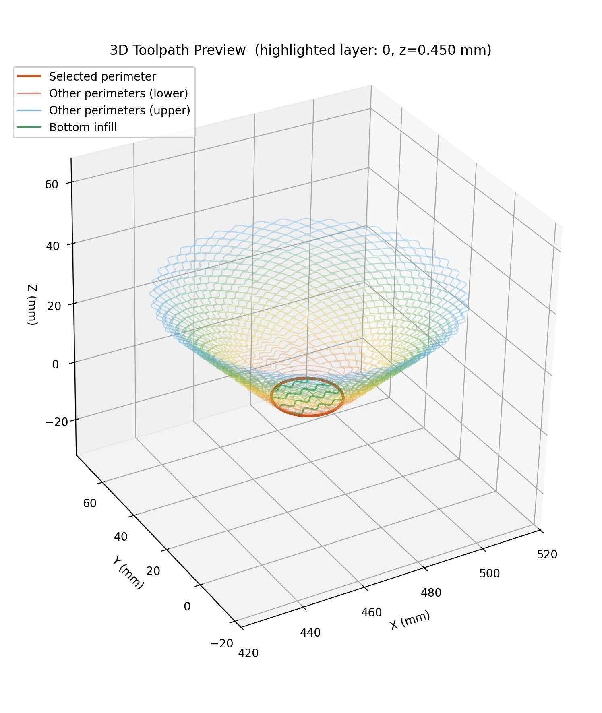

# AmiSlicer

> ⚠️ **Alpha版 (v0.01)** — 本ソフトウェアは開発段階のアルファ版です。
>
> ⚠️ **Alpha Release (v0.01)** — This software is in early development.

---

## 目次

- [AmiSlicer](#amislicer)
  - [目次](#目次)
  - [1. AmiSlicerとは](#1-amislicerとは)
    - [主な機能](#主な機能)
  - [2. インストール](#2-インストール)
    - [動作環境](#動作環境)
  - [3. 基本操作](#3-基本操作)
  - [4. 画面構成](#4-画面構成)
  - [5. 基本操作（詳細）](#5-基本操作詳細)
    - [5.1 STLファイルの読み込み](#51-stlファイルの読み込み)
    - [5.2 モデル回転](#52-モデル回転)
    - [5.3 3Dプリンタの基本設定](#53-3dプリンタの基本設定)
      - [5.3.1 Machineタブ](#531-machineタブ)
      - [5.3.2 Print タブ](#532-print-タブ)
    - [5.4 Wave タブ](#54-wave-タブ)
      - [5.4.1 Wave Settings（グループボックス）](#541-wave-settingsグループボックス)
      - [5.4.2 Bottom Settings（グループボックス）](#542-bottom-settingsグループボックス)
  - [6. プレビュー / Preview](#6-プレビュー--preview)
    - [6.1 2Dプレビュー](#61-2dプレビュー)
    - [6.2 3Dプレビュー](#62-3dプレビュー)
  - [7. 自己交差の検出と修正](#7-自己交差の検出と修正)
    - [7.1 検出](#71-検出)
    - [7.2 修正手順](#72-修正手順)
    - [7.3 G-code保存時の警告](#73-g-code保存時の警告)
  - [8. G-code の保存](#8-g-code-の保存)
  - [9. 設定の保存と読み込み](#9-設定の保存と読み込み)
    - [9.1 保存](#91-保存)
    - [9.2 読み込み](#92-読み込み)
    - [9.3 デフォルト設定](#93-デフォルト設定)
  - [10. G-codeプレビュー](#10-g-codeプレビュー)
  - [11. キーボードショートカット](#11-キーボードショートカット)
  - [12. トラブルシューティング](#12-トラブルシューティング)
    - [プレビューが空になる](#プレビューが空になる)
    - [自己交差が修正できない](#自己交差が修正できない)
  - [13. 注意事項](#13-注意事項)
  - [14. 安全に関する注意](#14-安全に関する注意)
  - [15. ライセンス / License](#15-ライセンス--license)

---

## 1. AmiSlicerとは

AmiSlicerは、STLファイルを読み込み、外周にSIN波の変形を加えたG-codeを生成するデスクトップアプリケーションです。「編む」ような独特の表面テクスチャを持つ3Dプリント造形物を作ることができます。



### 主な機能

* **STLスライス** — STLメッシュをレイヤーごとにスライス
* **波生成** — 外周に波を生成（振幅・波数を自由に設定）
* **位相交互反転** — レイヤー間で位相を180°反転し、編み目模様（アミアミ構造）を生成
* **Z方向変調** — 波をZ方向にも生成し、立体的な波表面を生成（ぴょんぴょん造形）
* **自己交差検出・修正** — 波同士の重なり（自己交差）を検出。簡易修正機能あり。
* **2D/3Dプレビュー** — リアルタイムプレビューで形状を確認。2Dはレイヤー単位、3Dは立体全体を表示
* **G-Code生成** ー G-Codeデータを出力
* **設定の保存/読み込み** — JSON形式で設定をプロジェクト間で共有

---

## 2. インストール

### 動作環境

* macOS / Windows

1. [リリースページ](https://github.com/kasanetarium/AmiSlicer)から最新版をダウンロードしてください。
   [https://github.com/kasanetarium/AmiSlicer](https://github.com/kasanetarium/AmiSlicer)

| OS      | ファイル / File                |
| ------- | ------------------------------ |
| macOS   | `AmiSlicer-macos0.01.zip`    |
| Windows | `AmiSlicer-windows0.0-1.zip` |

1. ZIPを解凍
2. 実行ファイルをダブルクリックで起動 / Double-click the executable to launch
   * **Windows** : `AmiSlicer.exe`
   * **macOS** : `AmiSlicer.app`（初回は右クリック →「開く」が必要な場合があります）

---

## 3. 基本操作

```text
① STLを読み込む          →  Open STL...
② モデルの向きを調整      →  Rotate X/Y/Z → Apply Rotation
③ 3Dプリンタの基本設定    →  Machine / Printタブ
④ 波の設定              →  Wave タブ
⑤ プレビューで確認        →  2D Preview / 3D Preview
⑥ 自己交差があれば修正     →  Allow SI → Fix Self-Intersections
⑦ G-codeを保存            →  Save G-code...
⑧ 3Dプリンタで造形
```

---

## 4. 画面構成


---

## 5. 基本操作（詳細）

### 5.1 STLファイルの読み込み




1. **「Open STL…」** ボタンまたはメニュー **File → Open STL…** (`Ctrl+O`) をクリックまたはSTLファイルをソフト画面にドラッグ&ドロップ
2. `.stl` ファイルを選択
3. 読み込み後、以下の情報が表示されます
   * **Size X/Y/Z** — モデルのバウンディングボックスサイズ (mm)
   * **Faces** — 三角面の数
   * **Manifold** — Yes（閉じた形状）/ No（非マニフォールド、断面に問題が出る可能性）
4. 自動的にスライスとプレビューが生成されます

---

### 5.2 モデル回転

STLモデルの向きを変更してスライス方向を調整します

| 操作                      | 説明                              |
| ------------------------- | --------------------------------- |
| **Rotate X**        | X軸周りの回転（デフォルト: 90°） |
| **Rotate Y**        | Y軸周りの回転                     |
| **Rotate Z**        | Z軸周りの回転                     |
| **Apply Rotation**  | 回転を適用してプレビュー更新      |
| **Reset**           | 全回転を0°にリセット             |
| **Mesh 3D Preview** | 回転後のメッシュを3D表示          |

> 💡 パラメータ変更時にプレビューは自動更新されます

---

### 5.3 3Dプリンタの基本設定

#### 5.3.1 Machineタブ



3Dプリンターのハードウェア設定です

使用する3Dプリンタの仕様や普段使っているスライスソフトの設定を確認してください。

**⚠️Start G-code、End G-codeはノズルやベットの加熱・冷却が含まれるため正しく入力しないと3Dプリンタの故障や事故が発生する恐れがあります。現在使っている3Dプリンタのスライスソフトからコピーするなどして、正しく入力してください。**

| 設定              | デフォルト         | 説明                     |
| ----------------- | ------------------ | ------------------------ |
| Bed Size X/Y/Z    | 220 / 220 / 250 mm | プリンターベッドサイズ   |
| Nozzle Diameter   | 0.4 mm             | ノズル径                 |
| Filament Diameter | 1.75 mm            | フィラメント径           |
| Start G-code      | ホーミング・加熱等 | 出力先頭のカスタムG-code |
| End G-code        | 冷却・退避等       | 出力末尾のカスタムG-code |

#### 5.3.2 Print タブ



印刷パラメータの設定です。

使用するフィラメントや3Dプリンタの仕様も確認のうえ、入力してください。

| 設定              | デフォルト   | 説明                                  |
| ----------------- | ------------ | ------------------------------------- |
| Layer Height      | 0.2 mm       | レイヤー高                            |
| Line Width        | 0.4 mm       | ライン幅（推奨: ノズル径の100〜120%） |
| Nozzle Temp       | 200 °C      | ノズル温度                            |
| Bed Temp          | 60 °C       | ベッド温度（0で無効）                 |
| 1st Layer Speed   | 1200 mm/min  | 1層目印刷速度                         |
| Perimeter Speed   | 3000 mm/min  | 外周印刷速度                          |
| Travel Speed      | 7200 mm/min  | 非印刷移動速度                        |
| Flow Multiplier   | 1.0          | 押出フロー倍率                        |
| 1st Layer Flow    | 1.1          | 1層目フロー倍率                       |
| Retraction Length | 1.0 mm       | リトラクション距離                    |
| Retraction Speed  | 2700 mm/min  | リトラクション速度                    |
| Fan Speed         | 100 (0–255) | ファン速度                            |
| Center on bed     | ON           | G-code出力時にベッド中心に配置        |

### 5.4 Wave タブ



波の設定です。AmiSlicerの核となる機能です。Wave タブは **Wave Settings** ・ **Bottom Settings** ・ **Print Settings (synced)** の3つのグループで構成されています。

> 💡 Waveタブ下部に **Print Settings (synced)** グループがあり、 **Layer Height** ・ **Line Width** ・ **Nozzle Temp** ・ **Flow Multiplier** ・ **Perimeter Speed** をWaveタブからも確認・変更できます。これらの値はPrintタブと双方向同期しています。

#### 5.4.1 Wave Settings（グループボックス）

**基本パラメータ**

| 設定                                     | デフォルト | 説明                                              |
| ---------------------------------------- | ---------- | ------------------------------------------------- |
| **Amplitude**                      | 1.0 mm     | 波の振幅（波の大きさ）                            |
| **Wave Count / Layer**             | 20         | 1レイヤーあたりの波の数                           |
| **Wave Start Layer (from Bottom)** | 0          | 波を開始するレイヤー（Bottom Layersからの相対値） |

**チェックボックス**

| 設定                                         | デフォルト | 説明                                      |
| -------------------------------------------- | ---------- | ----------------------------------------- |
| **Alternate phase**                    | ON         | レイヤー間で位相を180°反転（編み目模様） |
| **Allow self-intersection in preview** | OFF        | 自己交差のある波形もプレビュー表示        |
| **Move sine in Z direction**           | OFF        | Z方向にも波を適用                         |
| **Z Mod Amplitude**                    | 0.2 mm     | Z方向の波の振幅                           |
| **Adapt Z phase to taper**             | OFF        | テーパー方向にZ位相を適応                 |
| **Start loop from min Z**              | ON         | Z最小点から印刷開始                       |

#### 5.4.2 Bottom Settings（グループボックス）

底面レイヤーに関する設定をまとめたグループです。

| 設定                    | デフォルト | 説明                                                     |
| ----------------------- | ---------- | -------------------------------------------------------- |
| **Bottom Layers** | 1          | 底面レイヤー数（0も可。Wave Start Layer の基準にもなる） |

| 設定 / Setting                          | デフォルト / Default | 説明 / Description                                      |
| --------------------------------------- | -------------------- | ------------------------------------------------------- |
| **Fill bottom**                   | ON                   | 底面塗りつぶしパターンの有効/無効。無効の場合、底なし。 |
| **Apply sine wave to fill lines** | OFF                  | 底面充填ラインに波を適用                                |
| **Bottom Fill Pitch**             | 0.4 mm               | 充填ライン間隔                                          |
| **Bottom Fill Angle**             | 0.0 deg              | 充填ライン角度（レイヤーごと+90°回転）                 |

**底面外周の波モード** — 以下の3つから選択:

| 選択肢 / Option                      | 説明 / Description                                 |
| ------------------------------------ | -------------------------------------------------- |
| **Original contour (no wave)** | 底面レイヤーの外周は元の輪郭のまま（デフォルト）   |
| **Apply sine wave (XY only)**  | XY方向のみ波を適用（Z方向の変位なし）              |
| **Apply sine wave (XYZ)**      | XY + Z方向のSIN波を適用（Z modulation がONの場合） |

> 💡 Bottom Layers は Fill bottom のON/OFFに関係なく常に有効です（0に設定するとbottomレイヤーなし）。Wave Start Layer は Bottom Layers からの相対値で指定します。Alternate phase が有効な場合、位相はbottomレイヤーからwaveレイヤーまで連続的に交互反転します。

---

## 6. プレビュー / Preview

### 6.1 2Dプレビュー



選択中のレイヤーの輪郭を表示します。

| 表示要素        | 説明                   |
| --------------- | ---------------------- |
| 🔵 青線         | 元の輪郭               |
| 🔴 赤線         | 波変形後の輪郭         |
| 🟠 オレンジ太線 | 自己交差のある変形輪郭 |
| 🟢 緑線         | 底面充填パターン       |

### 6.2 3Dプレビュー



全レイヤーを積み重ねた3D表示です。

マウスのドラッグで回転、ホイールでズーム可能です。

| 表示要素        | 説明                   |
| --------------- | ---------------------- |
| 🔴 赤線         | 選択中のレイヤー       |
| 🟠 オレンジ太線 | 自己交差のある変形輪郭 |

レイヤーの切り替え操作

| 操作         | 方法                             |
| ------------ | -------------------------------- |
| スライダー   | 右パネルの縦スライダーをドラッグ |
| 次のレイヤー | `→`または `↓`キー          |
| 前のレイヤー | `←`または `↑`キー          |

---

## 7. 自己交差の検出と修正

凹形状（星形など）では、波の振幅が大きいと輪郭が自分自身と交差することがあります。

### 7.1 検出

* 自動的に各レイヤーで自己交差を検出し、自己交差が発生しているレイヤーをオレンジ色で警告しています。

### 7.2 修正手順

まずは、波の振幅（ **Amplitude** ）を小さくする、波の数（Wave Count）を変更する、使用するSTLファイル自体を変更するなどして、自己交差が発生しないようにすることをおすすめします。どうしてもこのまま造形したい場合は、以下のいずれかの修正ボタンをクリックすることで強制的に自己交差を無くせます。

| ボタン / Button                        | 動作 / Action                                               |
| -------------------------------------- | ----------------------------------------------------------- |
| **Fix Self-Intersections**       | 自己交差周期のみ振幅を局所的に0にする（波を可能な限り保持） |
| **Fallback to Original Contour** | 自己交差レイヤーを元の輪郭（波なし）に置き換え              |

1. **Fix Self-Intersections** の場合、修正アルゴリズムが実行されます。
   * 自己交差している **波の周期のみ** 振幅を0にします
   * それ以外の周期は設定通りの振幅を維持します
   * 隣接周期も段階的にテーパリング（50% → 75% → 0%）
2. 修正結果がプレビューに反映されます
3. 修正前の状態に戻したい場合は **「Restore Self-Intersections」** をクリックします

> 💡 修正後もまだ自己交差が残る場合は、振幅を小さくする、波の数を変更する、またはSTLファイル自体を変更するなどの調整を検討してください。

### 7.3 G-code保存時の警告

自己交差が残った状態でG-codeを保存しようとすると、確認ダイアログが表示されます。

---

## 8. G-code の保存

1. プレビューで形状を確認
2. **「Save G-code…」** ボタンまたは下部のボタンをクリック
3. 保存先を指定（`.gcode` 拡張子）

> 💡 **Preview G-code…** を押すことでG-codeを保存前に確認できます。

---

## 9. 設定の保存と読み込み

### 9.1 保存

設定を保存することができます。

* **「Save Settings…」** をクリック、または **File → Save Settings…** (`Ctrl+S`)
* Machine / Print / Wave の全設定をJSON形式で保存
* ファイル名はデフォルトでSTLファイルと同じ名称が候補として入力されます

### 9.2 読み込み

* **「Load Settings…」** をクリック、または **File → Load Settings…** (`Ctrl+Shift+O`)
* 設定JSONファイルをウインドウにドラッグ＆ドロップすることでも読み込めます

### 9.3 デフォルト設定

3Dプリンタの設定などはデフォルト設定で保存しておくことをおすすめします。

| メニュー                                    | 動作                                                                     |
| ------------------------------------------- | ------------------------------------------------------------------------ |
| **File → Save as Default**           | 現在の設定をデフォルトとして保存。次回起動時から自動的に読み込まれます。 |
| **File → Reset to Default**          | 保存済みのデフォルト設定に戻します。                                     |
| **File → Reset to Factory Defaults** | 配布時の初期設定に戻します（保存済みデフォルトも削除）。                 |

デフォルト設定は `~/.config/amislicer/default.json` に保存されます。

---

## 10. G-codeプレビュー

**「Preview G-code」** ボタンで、生成されるG-codeの内容をテキストで確認できます。

---

## 11. キーボードショートカット

| ショートカット   | 機能              |
| ---------------- | ----------------- |
| `Ctrl+O`       | STLファイルを開く |
| `Ctrl+S`       | 設定を保存        |
| `Ctrl+Shift+O` | 設定を読み込み    |
| `Ctrl+Q`       | アプリを終了      |
| `←` / `↑`  | 前のレイヤー      |
| `→` / `↓`  | 次のレイヤー      |

---

## 12. トラブルシューティング

### プレビューが空になる

* **Manifold** が `No` の場合、断面処理が失敗している可能性があります
* モデルの回転を調整してみてください

### 自己交差が修正できない

* Wave Count を減らす（波長を長くする）
* Amplitude を小さくする
* モデルの凹凸が激しい部分では修正に限界があるので、STLファイルを変更することをお勧めします

---

## 13. 注意事項

* 枝分かれするような形状（断面が複数になる形状）には対応していません。
* 内側にも構造がある形状（ドーナツのような形状）には対応していません。
* 編み込まれた形状を作るには、製作したい造形物の形状、ノズル径、フィラメント材料、3Dプリンタが設置されている環境に合わせて、ノズル温度、ワーク速度、押し出し量などのパラメータを細かく調整する必要があります。

---

## 14. 安全に関する注意

> ⚠️ **重要**

* 本ソフトウェアはアルファ版です。予期しない動作やバグが含まれている可能性があります。
* 本ソフトウェアは **3Dプリンタのヒーター温度やモーターを制御するG-codeを生成** します。十分に注意して使用してください。
* **印刷中は3Dプリンターから離れないでください。**
* 初めての設定では **テスト印刷** を行い、温度や動作が正常であることを確認してください。
* 印刷後、ノズルやヒートベッドの温度などが冷却され、正常に印刷終了できていることも確認してください。
* 本ソフトウェアを使用して生じたいかなる損害についても、製作者は責任を負いかねます。

---

## 15. ライセンス / License

MIT License

Copyright (c) 2026 Yosuke Hori / kasanetarium

詳細は [LICENSE](LICENSE) ファイルを参照してください。

See the [LICENSE](LICENSE) file for details.

---

<p align="center">
<strong>AmiSlicer v0.01 Alpha</strong><br>
製作者 / Author: 堀 洋祐 (Yosuke Hori) / カサネタリウム (kasanetarium)
</p>
